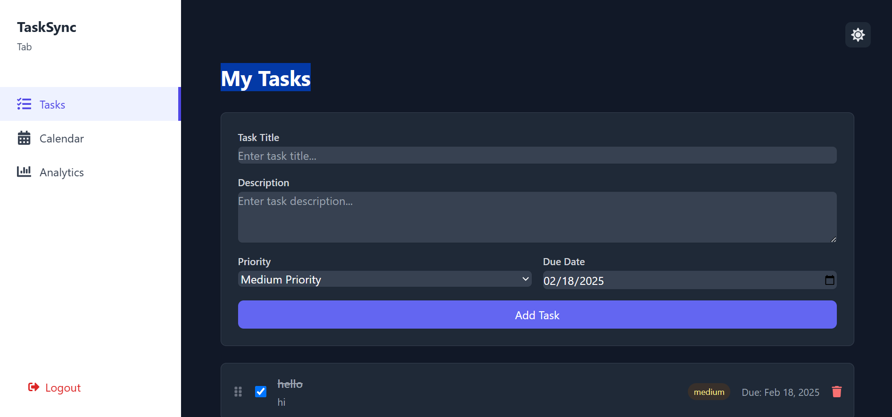
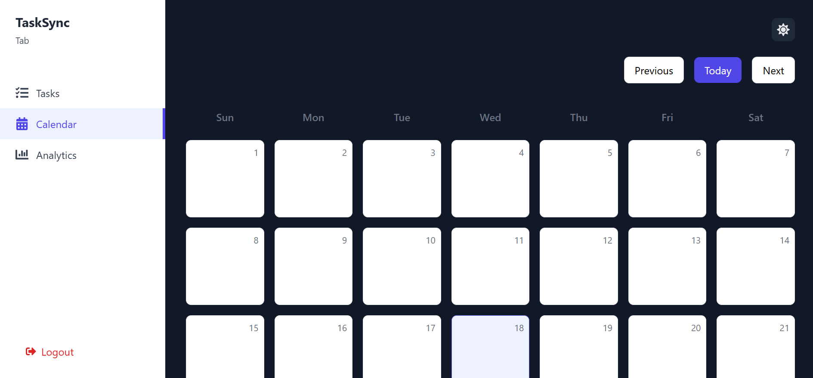
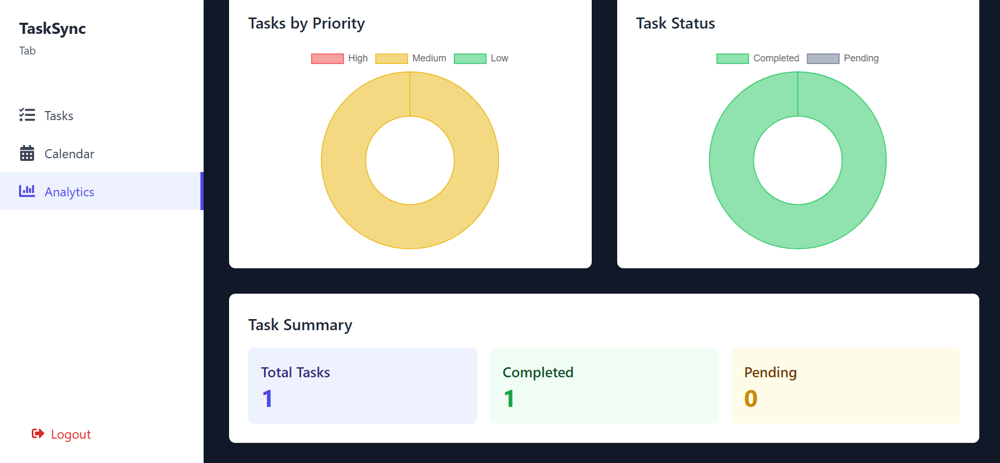

# TaskSync

TaskSync is a task management web application designed to help users efficiently organize their tasks. It provides features like authentication, task prioritization, drag-and-drop sorting, and more.

## 🚀 Deployed Site

[TaskSync Live](https://task-sync-1.netlify.app/)

## 📌 Features

- **User Authentication** – Secure login with Firebase Authentication.
- **Task Management** – Create, edit, delete, and mark tasks as completed.
- **Drag & Drop Sorting** – Easily reorder tasks with smooth drag-and-drop functionality.
- **Priority Levels** – Assign tasks Low, Medium, or High priority.
- **Due Dates** – Set due dates for better task organization.
- **Dark Mode** – Switch seamlessly between light and dark mode.

## 🛠 Tech Stack

- **Frontend:** React, Tailwind CSS, DnD Kit
- **Backend:** Firebase Firestore
- **Authentication:** Firebase Authentication
- **Hosting:** Firebase Hosting

## 📸 Screenshots

[](https://github.com/daxp472/TaskSync/blob/main/src/assets/img-1.png)
[](https://github.com/daxp472/TaskSync/blob/main/src/assets/img-2.png)
[](https://github.com/daxp472/TaskSync/blob/main/src/assets/img-3.png)

## 📥 Installation

### Prerequisites

- Node.js installed on your system.
- Firebase project setup.

### Steps

1. **Clone the repository:**

   ```bash
   git clone https://github.com/daxp472/TaskSync.git
   cd TaskSync
   ```

2. **Install dependencies:**

   ```bash
   npm install
   ```

3. **Set up Firebase:**

   - Create a Firebase project.
   - Enable Firestore Database and Authentication.
   - Add Firebase credentials in a `firebase.js` file:

   ```javascript
   import { initializeApp } from "firebase/app";
   import { getFirestore } from "firebase/firestore";
   import { getAuth } from "firebase/auth";

   const firebaseConfig = {
     apiKey: process.env.REACT_APP_FIREBASE_API_KEY,
     authDomain: process.env.REACT_APP_FIREBASE_AUTH_DOMAIN,
     projectId: process.env.REACT_APP_FIREBASE_PROJECT_ID,
     storageBucket: process.env.REACT_APP_FIREBASE_STORAGE_BUCKET,
     messagingSenderId: process.env.REACT_APP_FIREBASE_MESSAGING_SENDER_ID,
     appId: process.env.REACT_APP_FIREBASE_APP_ID,
   };

   const app = initializeApp(firebaseConfig);
   const db = getFirestore(app);
   const auth = getAuth(app);

   export { db, auth };
   ```

4. **Run the development server:**

   ```bash
   npm start
   ```

## 🎯 Usage

- Sign in using your Google account.
- Add new tasks with a title, description, priority, and due date.
- Drag and drop tasks to reorder them.
- Mark tasks as completed.
- Delete tasks when no longer needed.

## 🤝 Contributing

Contributions are welcome! Follow these steps:

1. Fork the repository.
2. Create a new branch (`git checkout -b feature-branch`).
3. Make your changes and commit them (`git commit -m 'Added new feature'`).
4. Push to the branch (`git push origin feature-branch`).
5. Create a Pull Request.

## 📜 License

This project is licensed under the MIT License.

## 📬 Contact

For any queries or support, reach out at:

- **Email:** daxpatel.cg@gmail.com
- **LinkedIn:** [Dax Patel](https://www.linkedin.com/in/dax-cg/)

## 🔗 Acknowledgements

This project was built using:

- [React](https://reactjs.org/)
- [Tailwind CSS](https://tailwindcss.com/)
- [DnD Kit](https://dndkit.com/)
- [Firebase](https://firebase.google.com/)
- [Heroicons](https://heroicons.com/)
- [Unsplash](https://unsplash.com/)
- [Font Awesome](https://fontawesome.com/)
- [Google Fonts](https://fonts.google.com/)
- [Feather Icons](https://feathericons.com/)
- [React Icons](https://react-icons.github.io/react-icons/)
- [React Router](https://reactrouter.com/)